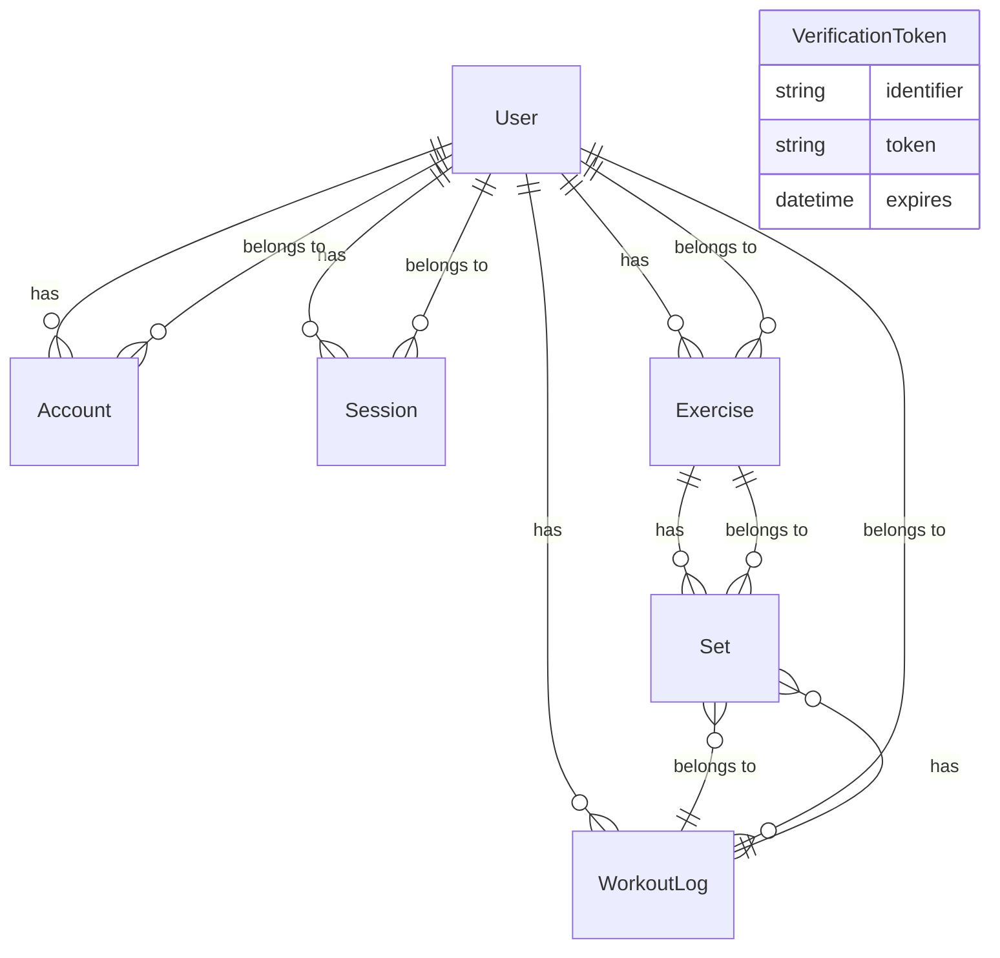

# 開発環境

- **フレームワーク**: Next.js 15, React 19, TypeScript 5
- **スタイリング**: Tailwind CSS 4
- **認証**: NextAuth.js + Prisma Adapter
- **ORM/DB**: Prisma, PostgreSQL（DATABASE_URLで接続）
- **PWA対応**: next-pwa
- **多言語対応**: next-intl（日本語・英語）
- **状態管理**: zustand
- **その他**: Radix UI, dayjs, date-fns, ESLint

## セットアップ

1. 依存パッケージのインストール

   ```bash
   npm install
   ```

2. 環境変数`.env`を作成し、DATABASE_URLなどを設定

3. Prismaマイグレーション（DB初期化）

   ```bash
   npx prisma migrate dev
   ```

4. 開発サーバー起動

   ```bash
   npm run dev
   ```

## 主なコマンド

- `npm run dev` : 開発サーバー起動
- `npm run build` : 本番ビルド
- `npm run start` : 本番サーバー起動
- `npm run lint` : ESLintによる静的解析

# プロジェクト構成

## Prisma ER図



## ディレクトリ構成

- `src/app` : Next.js アプリ本体
- `src/components` : UI/ロジックコンポーネント
- `src/i18n` : 多言語対応
- `src/lib` : ライブラリ・ユーティリティ
- `prisma` : Prismaスキーマ・マイグレーション
- `public` : 静的ファイル・PWA関連